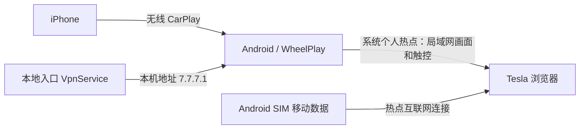

# Tesla CarPlay Local Entry

免 root Android 本地入口，让车机浏览器在局域网访问 WheelPlay 的 CarPlay 页面。

2026-10-07 已在 **Xiaomi 17 Pro Max / Android 16 + 2025 Model 3 Performance AWD / 2026.26.200.11** 上现场验证：车机显示 CarPlay，点击应用和拖动地图正常。这是一套设备上的实验结果，尚不代表其他手机或后续系统更新也兼容。

> **首次使用先看 [踩坑记录与解决方法](docs/PITFALLS.zh-CN.md)。** 热点最大连接数至少 3；使用设备热点模式和一致的凭据；关闭自适应浏览器尺寸；先恢复 CarPlay，再启动入口。该指南含可转发提示卡、40 项实际问题的处理方法、证据范围、回滚说明和问题报告模板。

## 工作方式



- 本地入口为 Android 建立地址别名；**不转码、不接收 CarPlay、不代理媒体、不连接云端**。接收与串流由独立安装的 [WheelPlay](https://github.com/fython/wheelplay) 完成。
- 浏览器入口：`http://7.7.7.1:8080/`。该地址不是本项目拥有的公网地址；只在已加入 Android 热点且本地入口运行时使用。
- 当前实车流程使用 **SIM 移动数据 + 系统普通个人热点 + WheelPlay「设备热点」模式**。之前的 Wi-Fi Direct 网络没有互联网共享，车机提示不能访问互联网并断开；固定 DIRECT 凭据不能解决这一问题。
- 画面和触控在内网传输。SIM 用于热点上网，满足本次车机接入需求；没有公网媒体中继。

## 仓库内容

| 路径 | 内容 |
| --- | --- |
| `app/` | 独立 Android 本地入口源码，只依赖 Android SDK |
| `scripts/build.ps1` | PowerShell 7 构建脚本，支持 Windows / Linux |
| `scripts/verify-source.ps1` | 发布文件与权限检查 |
| `patches/wheelplay/` | 针对固定上游提交的 GPL-3.0 WheelPlay 补丁 |
| `docs/SETUP.zh-CN.md` | 手机与车机操作步骤、停止和重启恢复 |
| `docs/TECHNICAL.md` | 接口机制、适用范围、排查与限制 |
| `docs/PITFALLS.zh-CN.md` | 使用提示卡、40 项踩坑与处理、排查和报告模板 |
| `docs/VALIDATION.md` | 已通过及尚未验证的项目 |

本仓库不包含 WheelPlay 自用 APK、认证私钥/证书、签名密钥、Wi-Fi 密码、配对数据或设备日志。**只安装本地入口无法建立 CarPlay：先准备一个可用的 WheelPlay 接收端及其所需的合法认证配置。** 认证相关要求以接收端上游为准；本项目不提供这些材料。

## 安装与使用

1. 使用源码构建本地入口 APK，安装到 Android。构建命令见下文。
2. Android 插入可上网的 SIM，开启移动数据、蓝牙和系统个人热点。热点最大连接设备数设为至少 **3**。此前配置为 1 时，电脑占用名额后，iPhone 会被系统热点主动断开。
3. WheelPlay 选择 **设备热点**，填入与系统热点相同的 SSID/密码，关闭 **自适应浏览器尺寸**，完成 iPhone 的 CarPlay 连接。
4. 如 Android 浏览器占用了显示会话，退出该网页；保持 WheelPlay 与热点运行。
5. 打开「CarPlay 本地入口」，点击启动并接受系统 VPN 授权。
6. Tesla 加入这个普通热点，打开 `http://7.7.7.1:8080/`，按页面配对并启动显示。停车后确认触控。

详细步骤见 [设置与恢复](docs/SETUP.zh-CN.md)。音频可另行尝试 iPhone → Tesla 蓝牙；**本次没有验收蓝牙音频、通话、Siri 或音画同步**。

## 构建本地入口

需要 JDK 17 或更新版本、PowerShell 7、Android SDK Platform 36 与 Build Tools 36.0.0。构建不需要 WheelPlay、不需要认证材料、不需要 Gradle。先通过 Android Studio SDK Manager 安装这些 SDK 组件。

```powershell
# PowerShell 7，在仓库目录执行。环境变量应指向你的 SDK 和 JDK。
pwsh -NoProfile -File ./scripts/verify-source.ps1
pwsh -NoProfile -File ./scripts/build.ps1 -AndroidSdkRoot $env:ANDROID_SDK_ROOT -JavaHome $env:JAVA_HOME
```

输出：`build/CarPlay-Local-Entry-0.4.0-debug.apk`。

脚本首次在本地生成并复用 `.local/debug.keystore`；这是开发签名，不作为公共发行签名。不要上传它。不同签名的 APK 不能直接覆盖安装；自行构建的 APK 可能与早期现场测试版签名不同。CI 只构建未签名 APK，不自动发布发行包。

公开源码 0.4.0 更新了普通热点说明，保持此前 0.3 的入口算法。现场验证对应 **0.3-local**；0.4.0 的源码构建验证与设备运行验证分别记录，不能视为已经升级过现场手机。

## WheelPlay 补丁

固定上游：[fython/wheelplay](https://github.com/fython/wheelplay)，提交 `d8b3a828f478b3b3508917c2e978d3264b47b532`。

`0001-manual-hotspot-ipv4.patch`：设备热点模式优先使用 IPv4，保留 IPv6 回退；包含对应测试。现场使用的是含该改动的接收端版本，但没有证明所有设备必须打此补丁。

`0002-stable-direct-credentials.patch`：可选的 DIRECT 凭据保存实验与测试。**普通热点流程不依赖它。** 它保留账号密码，不保证网络组不会断开或自动重连。

应用、构建与撤销方法见 [补丁说明](patches/wheelplay/README.md)。这些补丁不包含本机路径、下载缓存或认证配置。

## 权限与兼容性

本地入口声明前台服务、specialUse 和通知权限；VPN 服务受 `BIND_VPN_SERVICE` 保护。没有 `INTERNET` 权限、默认 VPN 路由、DNS 配置、启动广播或远端 VPN 服务器。启动会占用 Android 唯一活动 VPN 位置，可能停止其他 VPN。

原理依赖当前 Xiaomi / Android 16 对两次 VpnService 建立操作的接口生命周期和入站过滤处理，**不是 Android 公共 API 保证的地址别名功能**。系统更新后可能失效。最低 SDK 为 26，但尚未验证其他 Android 版本的实际效果。

点击「停止并回滚」关闭两个接口描述符并停止前台服务；重启后手动恢复热点、WheelPlay 和入口。没有开机自启，也不保证系统永远保留后台进程。

## 来源与许可证

本项目源码和 WheelPlay 补丁采用 **GPL-3.0-only**，见 [LICENSE](LICENSE) 和 [NOTICE](NOTICE)。WheelPlay、DiPlay/xcertplay 及其其他组件的原有声明由各自项目保留；这里没有复制它们的整套代码或素材。CarPlay、iPhone 和 Tesla 是各自所有者的商标，本项目不是官方产品。
